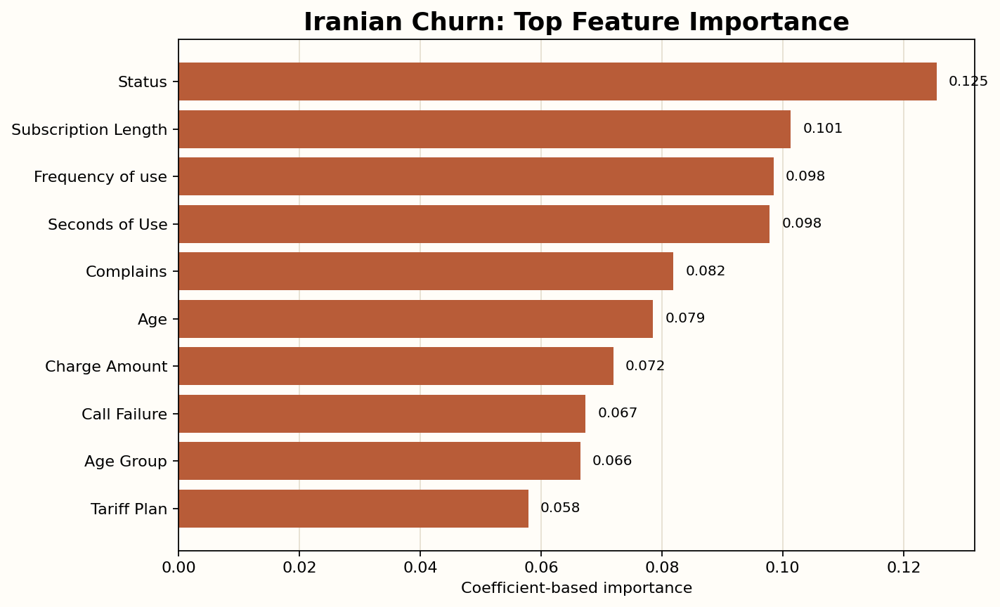
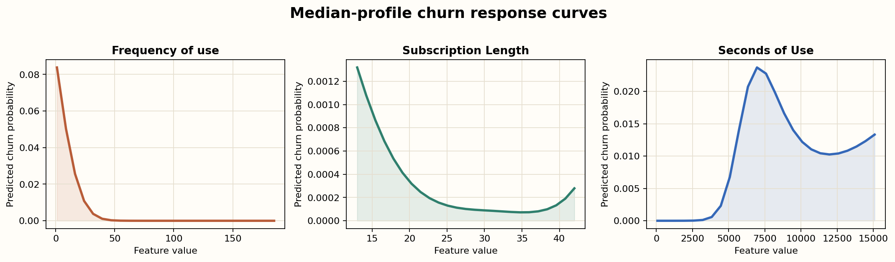
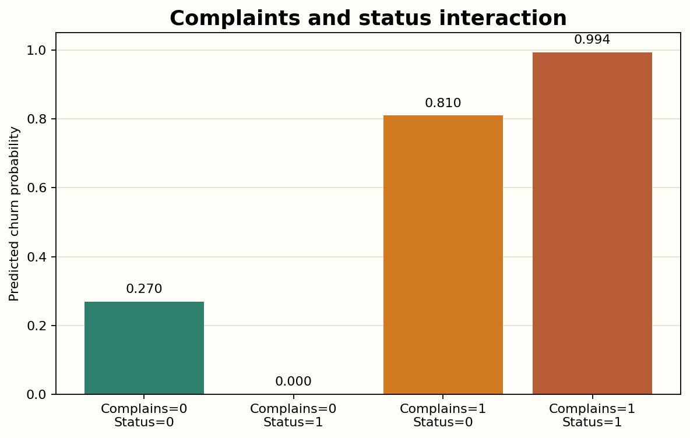

# SpectralPathClassifier on the Iranian Churn Dataset

Run date: 2026-05-29

## Summary

This was a focused exploratory test of `SpectralPathClassifier` on the UCI Iranian Churn dataset, using only the classifier model and its built-in interpretability tools.

The purpose of the analysis is to test the classification variant of the spectral-path model on a realistic churn dataset and to inspect what useful insights can be extracted from the model’s native interpretability mechanisms.

The classifier models

```text
f(x) = w0 + sum_q w_q phi_q(x),
P(churn = 1 | x) = sigmoid(f(x))
```

where each `phi_q(x)` is a directional harmonic term in angular feature space. As in the regression variant, the model remains explicit and inspectable through its selected spectral paths, coefficients, symbolic interaction terms, and analytic structure.

High-level takeaway:
- The classifier performs strongly on this dataset.
- It appears especially good at probability ranking and calibration-quality metrics for a compact tabular churn problem.
- The learned model remains inspectable through explicit spectral terms and feature-level importance.
- The dominant drivers are business-meaningful fields such as `Status`, `Subscription Length`, `Frequency of use`, `Seconds of Use`, and `Complains`.

Main caution:
- Some of the most influential variables, especially `Status`, should be reviewed carefully for business meaning and possible leakage risk before drawing strong conclusions from the learned structure.

## Interpretability First

Even though the model is nonlinear, it is still interpretable in three useful ways:
- globally: we can rank the most influential features
- structurally: we can inspect the explicit harmonic interaction terms in the logit equation
- locally: we can explain individual customer predictions through term contributions

Three immediate qualitative messages emerged from this churn run:
- complaints are a very strong churn signal
- higher `Frequency of use` is strongly protective in the fitted model
- churn risk is not controlled by single variables alone; interactions such as `Complains × Status` matter a lot

### Feature-importance view



This plot is a good “first glance” explanation:
- `Status`, `Subscription Length`, `Frequency of use`, `Seconds of Use`, and `Complains` dominate the model
- these are intuitive business variables rather than hidden latent features

### Qualitative effect plots



These curves vary one feature at a time around the median customer profile.

Most important qualitative patterns:
- `Frequency of use` has the clearest monotone effect in this analysis: as usage rises, predicted churn risk drops sharply.
- `Subscription Length` has a weaker but still mostly protective effect through the middle of the observed range.
- `Seconds of Use` behaves nonlinearly rather than monotonically, which is exactly the kind of structure a spectral model is designed to capture.

### Strong interaction example: complaints and status



At the median-profile customer:
- `Complains=0, Status=0` gives predicted churn around `0.270`
- `Complains=0, Status=1` gives predicted churn near `0.00007`
- `Complains=1, Status=0` gives predicted churn around `0.810`
- `Complains=1, Status=1` gives predicted churn around `0.994`

This is a great example of why the classifier is more interesting than a plain linear model:
- the effect of `Complains` is very large
- the effect of `Status` is not just additive; it interacts strongly with complaints
- the model is explicitly representing these interactions through a small set of harmonic terms

## Dataset

Source:
- UCI Iranian Churn dataset: [UCI page](https://archive.ics.uci.edu/dataset/563/iranian+churn+dataset)

Observed data characteristics in this run:
- `3150` customers
- `13` input features
- churn rate: `15.7%`
- all features numeric / integer-like, no missing values in the UCI metadata

Dataset context from the UCI description:
- the data was randomly collected from an Iranian telecom company over a period of 12 months
- each row represents one customer
- the non-target attributes are aggregated from the first 9 months
- the churn label is measured at the end of 12 months
- the 3-month gap acts as a planning horizon between the feature window and the churn outcome

Feature definitions used in this report:
- `Call Failures`: number of call failures
- `Complains`: binary (`0`: no complaint, `1`: complaint)
- `Subscription Length`: total months of subscription
- `Charge Amount`: ordinal (`0`: lowest amount, `9`: highest amount)
- `Seconds of Use`: total seconds of calls
- `Frequency of use`: total number of calls
- `Frequency of SMS`: total number of text messages
- `Distinct Called Numbers`: total number of distinct phone-call contacts
- `Age Group`: ordinal (`1`: younger age, `5`: older age)
- `Tariff Plan`: binary (`1`: pay as you go, `2`: contractual)
- `Status`: binary (`1`: active, `2`: non-active)
- `Customer Value`: calculated customer value
- `Churn`: binary class label (`1`: churn, `0`: non-churn)

This makes it a useful benchmark for the classifier variant:
- binary classification
- relatively compact feature space
- a mix of continuous, ordinal, and binary usage/account variables
- a realistic churn-style prediction task with a nonzero forecasting gap

## Model Setup

Model:
- `SpectralPathClassifier`
- `max_paths=128`
- `block_size=13`
- `lambda_grid=logspace(-4, -1, 8)`
- `k_values=(1, 2, 3)`
- `scaler_type="robust_tanh"`
- `bound_percentiles=(5, 95)`
- `greedy_subsample=2000`

Evaluation:
- 5-fold stratified cross-validation for performance stability
- separate 80/20 stratified holdout fit for interpretability analysis
- `random_state=42`

## Performance

### 5-fold cross-validation

| Metric | Mean | Std. Dev. |
| --- | ---: | ---: |
| Accuracy | 0.9498 | 0.0066 |
| Log loss | 0.1216 | 0.0165 |
| ROC-AUC | 0.9810 | 0.0057 |
| Brier score | 0.0354 | 0.0041 |
| R² on probability output | 0.7330 | 0.0309 |
| Selected paths | 128.0 | 0.0 |

Interpretation:
- Accuracy is strong and stable across folds.
- ROC-AUC is very high, which suggests the classifier ranks churn risk very well.
- Log loss and Brier score are both good, which is encouraging for calibrated probability output rather than just hard classification.
- The model used the full `128`-path budget in every fold, so this is not yet the sparsest possible presentation of the method.

### Holdout performance

| Metric | Value |
| --- | ---: |
| Accuracy | 0.9556 |
| Log loss | 0.1152 |
| ROC-AUC | 0.9828 |
| Brier score | 0.0318 |
| R² on probability output | 0.7599 |
| Selected paths | 128 |
| Selected lambda | 0.0001 |

Interpretation:
- The holdout numbers match the cross-validation story closely.
- This looks like a genuinely strong result rather than a lucky split.

## Global Interpretability

### Top features by coefficient-based importance

These come from the fitted spectral paths and coefficients, aggregated back to original features.

| Rank | Feature | Importance |
| --- | --- | ---: |
| 1 | `Status` | 0.1255 |
| 2 | `Subscription Length` | 0.1013 |
| 3 | `Frequency of use` | 0.0985 |
| 4 | `Seconds of Use` | 0.0978 |
| 5 | `Complains` | 0.0819 |
| 6 | `Age` | 0.0786 |
| 7 | `Charge Amount` | 0.0720 |
| 8 | `Call Failure` | 0.0674 |
| 9 | `Age Group` | 0.0665 |
| 10 | `Tariff Plan` | 0.0579 |

Interpretation:
- The model is driven mainly by intuitive churn-style variables rather than obscure proxies.
- Usage intensity, account tenure, complaints, and status-like indicators appear central.

### Top learned spectral terms

These are the largest learned harmonic interaction terms in the fitted logit model.

| Rank | Spectral term | Coefficient |
| --- | --- | ---: |
| 1 | `cos(theta[Subscription Length])` | -6.5307 |
| 2 | `cos(theta[Frequency of use])` | -6.1353 |
| 3 | `cos(theta[Complains] + 2*theta[Status])` | -6.0904 |
| 4 | `cos(2*theta[Seconds of Use] + theta[Status])` | +4.8498 |
| 5 | `cos(theta[Frequency of use] + theta[Age])` | -4.8094 |
| 6 | `cos(theta[Seconds of Use] + theta[Frequency of use])` | +4.6676 |
| 7 | `cos(theta[Status])` | +4.2259 |
| 8 | `cos(3*theta[Status])` | +4.2259 |
| 9 | `cos(theta[Subscription Length] + theta[Distinct Called Numbers] + theta[Status])` | -3.8731 |
| 10 | `cos(theta[Subscription Length] + theta[Age])` | +3.8398 |

What this says:
- The model is not just linear on raw features.
- It is using a mix of:
  - single-feature nonlinear terms
  - pairwise interactions
  - a few three-way interactions
- The strongest interactions revolve around `Status`, `Subscription Length`, `Frequency of use`, `Seconds of Use`, and `Complains`.

### Derivative-style interpretation for continuous features

Because the model is analytic, we can also inspect feature effects through partial derivatives. In practice, this is most reliable for the genuinely continuous features, not for near-binary fields such as `Complains`, `Tariff Plan`, and `Status`.

Across the holdout set, the average signed effect on predicted churn probability was mostly negative for:
- `Frequency of use`
- `Subscription Length`
- `Distinct Called Numbers`
- `Age`
- `Customer Value`

The strongest and cleanest derivative-style signal was `Frequency of use`, which matches the response-curve analysis above: heavier use tends to reduce predicted churn risk in the observed region.

The derivative signal for `Seconds of Use` was much weaker and more nonlinear, which again matches the response plot and suggests that raw volume alone is not acting as a simple threshold variable.

### Truncated symbolic model

```text
y_hat = -5.69032
  -6.53069 * cos(theta[Subscription  Length])
  -6.13526 * cos(theta[Frequency of use])
  -6.09045 * cos(theta[Complains] + 2*theta[Status])
  +4.84982 * cos(2*theta[Seconds of Use] + theta[Status])
  -4.8094 * cos(theta[Frequency of use] + theta[Age])
  +4.66755 * cos(theta[Seconds of Use] + theta[Frequency of use])
  +4.22593 * cos(theta[Status])
  +4.22593 * cos(3*theta[Status])
```

Probability is then:

```text
P(churn = 1 | x) = sigmoid(y_hat)
```

This is exactly the kind of explicit functional structure that is hard to get from boosted trees or larger black-box models.

This explicit equation is useful because it makes the “interpretable nonlinear classifier” idea concrete immediately rather than leaving the model as a black box.

## Example Customer-Level Explanations

The most reliable local explanations here came from term contributions to the logit, rather than raw gradient magnitudes. This is because some binary/ordinal features become effectively near-discrete under the current angular preprocessing, which can make gradient-based sensitivity numerically unstable even when the model itself is behaving sensibly.

### Highest predicted churn risk

Prediction:
- actual label: `1`
- predicted churn probability: `0.99999997`

Raw feature snapshot for the most globally important features:
- `Status = 1`
- `Subscription Length = 33`
- `Frequency of use = 44`
- `Seconds of Use = 710`
- `Complains = 1`
- `Age = 25`

Top contributing spectral terms:
- `+6.0904` from `cos(theta[Complains] + 2*theta[Status])`
- `-3.9368` from `cos(theta[Seconds of Use] + theta[Frequency of use])`
- `+3.6925` from `cos(2*theta[Seconds of Use] + theta[Status])`
- `-3.6124` from `cos(3*theta[Seconds of Use])`
- `+3.4406` from `cos(2*theta[Call Failure] + theta[Seconds of Use])`

Interpretation:
- The model is treating the combination of complaints, status, and low/moderate usage patterns as highly churn-like.

### Lowest predicted churn risk

Prediction:
- actual label: `0`
- predicted churn probability: `0.00000001`

Raw feature snapshot:
- `Status = 1`
- `Subscription Length = 29`
- `Frequency of use = 231`
- `Seconds of Use = 15580`
- `Complains = 0`
- `Age = 25`

Top contributing spectral terms:
- `-6.0763` from `cos(theta[Frequency of use])`
- `+4.4605` from `cos(theta[Seconds of Use] + theta[Frequency of use])`
- `+4.0587` from `cos(theta[Frequency of use] + theta[Age])`
- `+3.8060` from `cos(theta[Subscription Length])`
- `-3.3260` from `cos(3*theta[Seconds of Use])`

Interpretation:
- The strongest “safe” signal here seems to come from very high usage and no complaints, which the model treats as strongly non-churn-like.

### Most uncertain example

Prediction:
- actual label: `1`
- predicted churn probability: `0.4973`
- predicted class at 0.5 threshold: `0`

Raw feature snapshot:
- `Status = 1`
- `Subscription Length = 37`
- `Frequency of use = 100`
- `Seconds of Use = 5693`
- `Complains = 0`
- `Age = 25`

Top contributing spectral terms:
- `+4.7002` from `cos(theta[Frequency of use] + theta[Age])`
- `-4.1951` from `cos(2*theta[Seconds of Use] + theta[Status])`
- `+3.7509` from `cos(3*theta[Seconds of Use])`
- `+3.7436` from `cos(theta[Frequency of use] + theta[Age Group])`
- `-3.7240` from `cos(theta[Frequency of use])`

Interpretation:
- This customer sits near a decision boundary where multiple usage-related harmonic terms are pulling in opposite directions.
- That is actually a useful interpretability signal: the model is uncertain because the learned interaction structure is internally mixed, not because it is opaque.

## What Looks Good In This Analysis

- Strong predictive performance on a realistic churn dataset.
- High ROC-AUC and low Brier score suggest useful ranked risk scores and reasonable probability quality.
- The model can be explained globally through:
  - top features
  - explicit interaction terms
  - a compact symbolic logit equation
- It can also be explained locally through term contributions for individual customers.
- The new plots make it easier to tell a business story such as:
  - complaints sharply increase churn risk
  - high usage tends to reduce churn risk
  - some important drivers only make sense as interactions, not as single isolated variables

## What Needs Caution

### 1. `Status` looks extremely influential

This may be perfectly valid, but it should be reviewed carefully with domain experts.

Possible concern:
- `Status` may encode information that is very close to the eventual churn outcome or to late-stage customer state, which could make the learned structure look more decisive than it would be in a cleaner forecasting setup.

### 2. Binary / ordinal features behave differently under angular preprocessing

For continuous features, the angular harmonic interpretation is very natural.
For near-binary features such as `Complains`, `Tariff Plan`, and `Status`, the learned transforms can behave more like discrete switches than smooth curves.

That is not necessarily bad, but it means:
- coefficient / term-based explanations are safer than raw infinitesimal gradients
- preprocessing choices for binary and ordinal features may deserve a classifier-specific revisit

### 3. The model used the full path budget

The classifier selected all `128` allowed paths in every cross-validation fold.

That suggests one of two things:
- the dataset genuinely supports a fairly rich harmonic model, or
- the current stopping / budget settings are still a bit generous for a compact business-facing model

It may be worth testing a smaller path budget such as `32`, `48`, or `64` to see whether interpretability can be improved further with only a small performance tradeoff.

## Bottom Line

This is a good result.

On a real churn dataset, `SpectralPathClassifier` appears to offer:
- strong classification performance
- meaningful probability output
- genuinely interpretable nonlinear structure

More broadly, this supports the idea that the spectral-path framework can extend beyond regression into classification while retaining a strong interpretability story:
- the method looks viable for classification, not just regression
- the learned nonlinear structure can still be inspected analytically
- churn-style tabular problems are a useful setting for testing that claim
